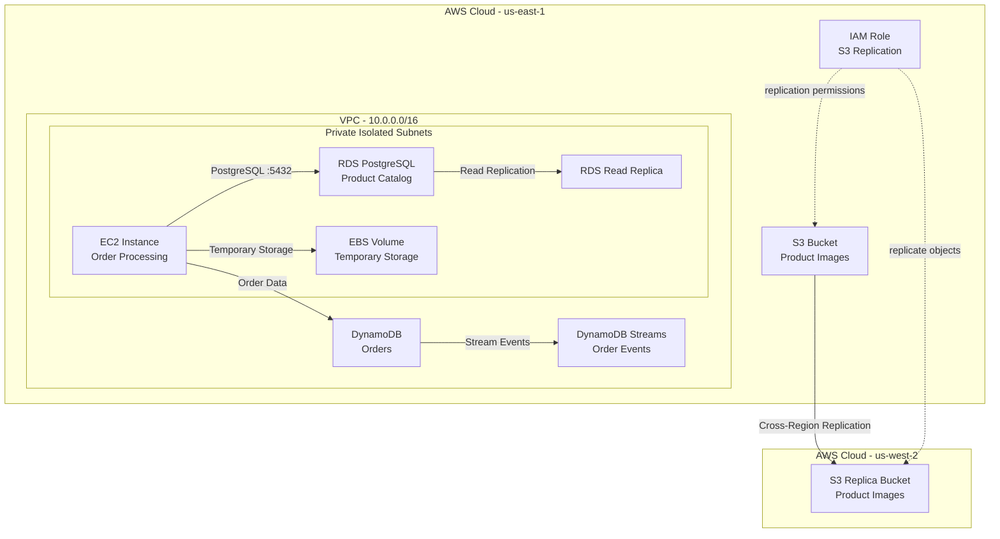

# Store Backend

Infrastructure project built with **AWS CDK** for an online store backend, demonstrating the appropriate AWS storage service for product images, product catalog, orders, and temporary order processing.

## Architecture



## AWS Services

| Service               | Purpose                                |
| --------------------- | -------------------------------------- |
| Amazon S3             | Product images and object storage      |
| Amazon RDS PostgreSQL | Relational product catalog             |
| Amazon DynamoDB       | Customer orders                        |
| Amazon EC2            | Temporary order processing             |
| Amazon EBS            | Block storage for temporary processing |
| Amazon VPC            | Network isolation                      |
| AWS IAM               | Replication permissions                |
| AWS CDK               | Infrastructure as Code                 |

## Storage Decisions

### S3 — Product Images

Amazon S3 is used for product images because images are objects that do not require a relational database structure.

The bucket includes:

* Block Public Access enabled
* S3-managed encryption
* Versioning
* Lifecycle transition to S3-IA after 90 days
* Cross-Region Replication to `us-west-2`

### RDS PostgreSQL — Product Catalog

Amazon RDS PostgreSQL stores the product catalog because products have structured relationships between:

* `products`
* `categories`
* `inventory`

The database is deployed in private isolated subnets and does not have a public IP.

A read replica is also configured to support read-heavy catalog workloads.

### DynamoDB — Orders

Amazon DynamoDB stores orders using:

* Partition key: `customerId`
* Sort key: `orderId`
* Billing mode: `PAY_PER_REQUEST`

DynamoDB Streams are enabled to capture real-time order changes.

### EBS — Temporary Processing

Amazon EBS provides block storage attached to the EC2 processing instance for temporary order-processing data.

Unlike S3, EBS provides block-level storage directly attached to the compute instance.

## Boss Fights

### 1. DynamoDB Streams

DynamoDB Streams are enabled with:

```text
NEW_AND_OLD_IMAGES
```

This allows order changes to be captured for potential real-time processing.

### 2. RDS Read Replica

An RDS PostgreSQL read replica is deployed in the same region to support additional read capacity for the product catalog.

```text
RDS Primary
     │
     ▼
RDS Read Replica
```

### 3. S3 Cross-Region Replication

Product images are replicated from:

```text
us-east-1
    │
    │ Cross-Region Replication
    ▼
us-west-2
```

Both buckets use versioning, and an IAM role grants S3 the required replication permissions.

Replication was verified using an uploaded test object with:

```text
ReplicationStatus: COMPLETED
```

## Tech Stack

* TypeScript
* AWS CDK
* Amazon VPC
* Amazon S3
* Amazon RDS PostgreSQL
* Amazon DynamoDB
* Amazon EC2
* Amazon EBS
* AWS IAM

## Deployment

Install dependencies:

```bash
cd cdk
npm install
```

Bootstrap the required AWS regions:

```bash
cdk bootstrap aws://ACCOUNT_ID/us-east-1
cdk bootstrap aws://ACCOUNT_ID/us-west-2
```

Synthesize the CloudFormation templates:

```bash
cdk synth
```

Deploy the replica stack:

```bash
cdk deploy StoreBackendReplicaStack
```

Deploy the primary stack using the replica bucket ARN:

```powershell
cdk deploy StoreBackendStack --parameters ReplicaBucketArn=arn:aws:s3:::REPLICA_BUCKET_NAME
```

## Verification

Check S3 replication configuration:

```bash
aws s3api get-bucket-replication \
  --bucket SOURCE_BUCKET_NAME \
  --region us-east-1
```

Upload a test object:

```bash
aws s3 cp test-replication.txt \
  s3://SOURCE_BUCKET_NAME/ \
  --region us-east-1
```

Check replication status:

```bash
aws s3api head-object \
  --bucket SOURCE_BUCKET_NAME \
  --key test-replication.txt \
  --region us-east-1
```

The object should eventually report:

```text
"ReplicationStatus": "COMPLETED"
```

Verify the object in the replica region:

```bash
aws s3 ls \
  s3://REPLICA_BUCKET_NAME/ \
  --region us-west-2
```

## Cleanup

To remove the primary infrastructure:

```bash
cdk destroy StoreBackendStack
```

Then remove the replica stack:

```bash
cdk destroy StoreBackendReplicaStack
```

The CDK bootstrap resources are separate from these stacks and are not removed by `cdk destroy`.
